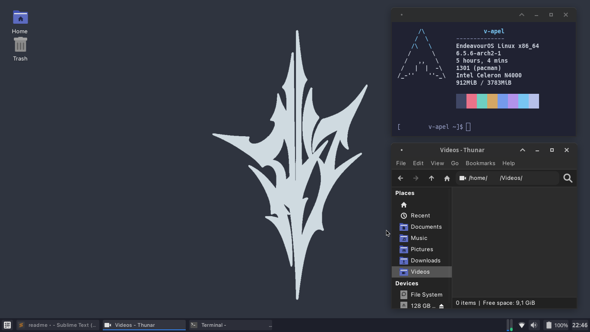

# my_xfce4_dots
    
Mains:  
Icons: <a href="https://github.com/zayronxio/Zafiro-icons">Zafiro-icons Light</a>  
GTK Theme: <a href="https://github.com/Fausto-Korpsvart/Tokyo-Night-GTK-Theme">Tokyo Night GTK Theme</a>    
Cursor: <a href="https://github.com/alvatip/Borealis-cursors">Borealis_cursors</a>   
Terminal: XFCE Terminal with <a href="https://github.com/HexyHack/tokyo-night-xfce-terminal">Tokyo Night color scheme</a>  
xfce4-docklike-taskbar    
Fonts:  
Terminal - Hack Regular  
System - SF Pro Display Regular  
Monospace - SF Mono Regular    
Shell:  
zsh with oh my zsh 
Plugins: zsh-autosuggestions & zsh-syntax-highlighting 
   
Firefox:  
about:config settings: <code>css.devPixelsPerPx: 0.9
browser.compactmode.show: true</code>  
Theme: <a href="https://addons.mozilla.org/en-US/firefox/addon/no-face-spirited-away/">No Face - Spirited Away</a>    
qBittorrent theme: <a href="https://github.com/maboroshin/qBittorrentDarktheme">Iceberg</a>  
Xmodmap config: Modded for Chromebook (with iso key swapped as Super L and Caps Lock instead of Search button. Brightness keys on keyboard are not working.

